## Лабораторная работа №3

Сами решения содержатся в папках, название которых совпадает с названием упражнения. 
Так же хочу напомнить, что у меня возникли сложности при работе с исходным репозиторием и поэтому я работала с другим, в котором 4 задание отличается.

### Упражнение 1: RideCleansingExercise.

Необходимо было отфильтровать поток данных записей поездок на такси, чтобы сохранить только поездки, которые начинаются и заканчиваются в пределах Нью-Йорка.

Для определения местоположения начала и окончания поездки был использован метод isInNYC().

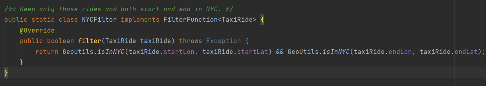

Тест

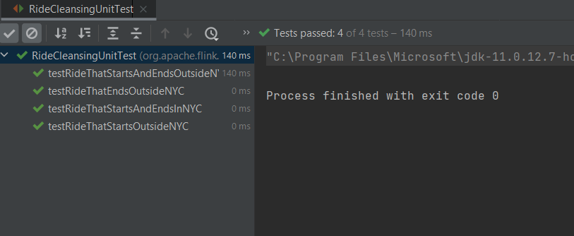

### Упражнение 2: RidesAndFaresExercise.

Цель этого упражнения - обогатить поездки на такси информацией о тарифах.
Для регения задачи мы переопределяем методы класса:

open - в нем мы получаем состояния для TaxiRide и TaxiFare.

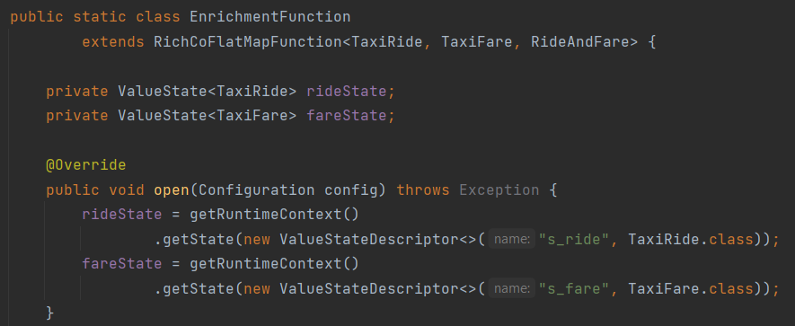

FlatMap1 и FlatMap2 - вызываются для элементов первого и второго потока соответственно.
Когда мы работаем со значением из состояния, то насамом деле мы работаем с набором значений, которые сгруппированы по ключу, в данном случае по ID поездки.

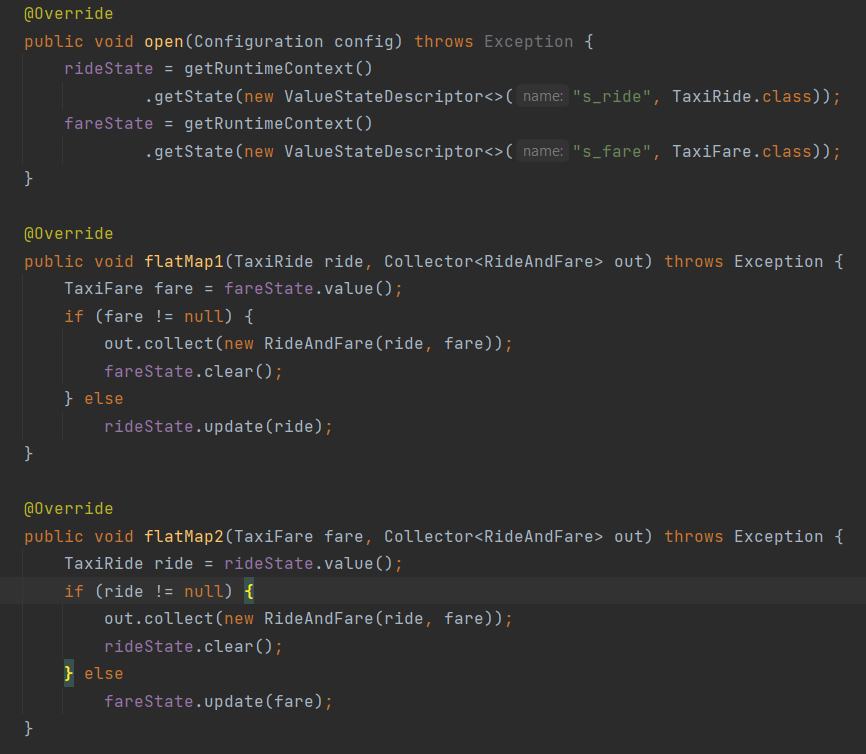

Тест

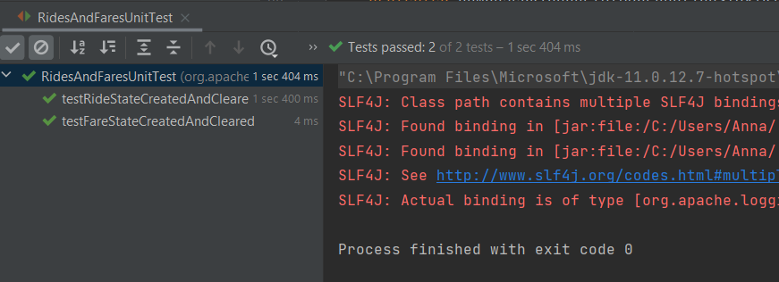

### Упражнение 3: HourlyTipsExercise.

Задача упражнения состоит в том, чтобы сначала подсчитать общее количество чаевых, собранных каждым водителем, в час, а затем из этого потока найдите самую высокую общую сумму чаевых за каждый час.

В данной работе необходимо будет работать со временем, а значит понадобиться использовать водные и временные метки. В качестве этих меток устанавливаем время начала поезки.
Затем группируем по ID водителя, затем разбиваем по временным окнам продолжительностью час и рассчитываем сумму полученных чаевых для каждого окна.
Среди них ищем максимум, затем записываем полученный результат в приёмник.

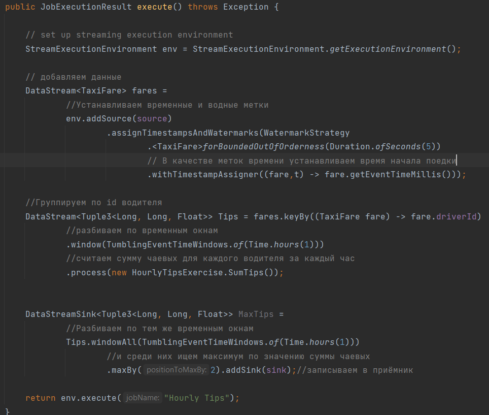

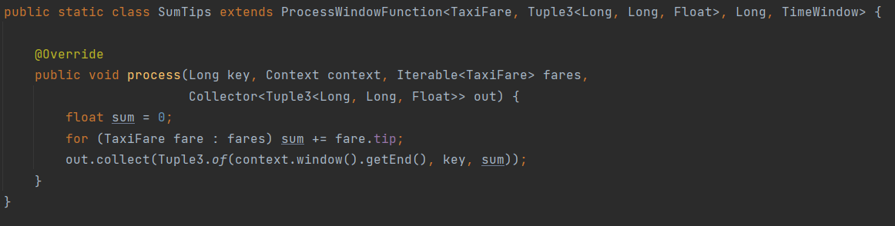

Тест

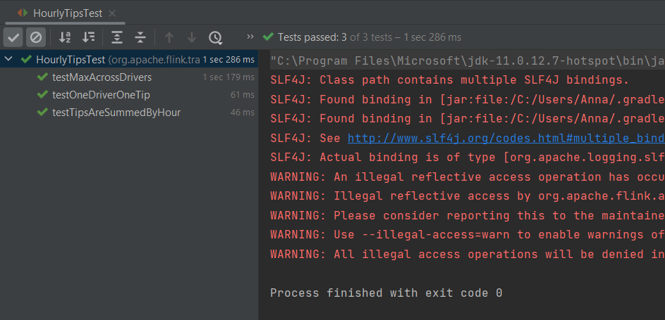

### Упражнение 4: LongRidesExercise.
Цель этого упражнения состоит в том, чтобы выдавать ID для поездок на такси продолжительностью более двух часов. Вы должны предположить, что события поездки на такси могут быть потеряны.
В конечном итоге вы должны очистить любое созданное вами состояние.

За нас уже было написано получение потока из источника. Были установлены водяные и временные метки, а так же проведена группировка по ключу - rideId.

Как известно для каждой поездки существует два собития - начало и конец. Так как мы сгруппировали всё по Id поездок, то теперь каждое значение состояния будет содержать оба этих события для каждой поездки, либо одно из них, если имеет место потеря данных или событие ещё не завершилось. Поэтому проверяем все возможные случаи.
Знакомимся с методом registerEventTimeTimer, который регистрирует таймер, который будет запущен, когда водяной знак времени события пройдет заданное время, и deleteEventTimeTimer, который помогает удалить таймер.

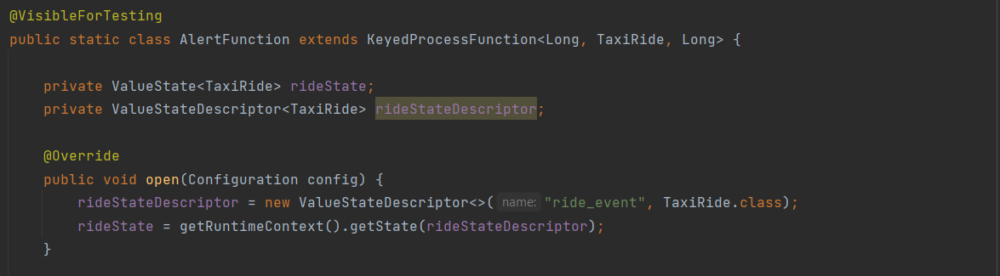

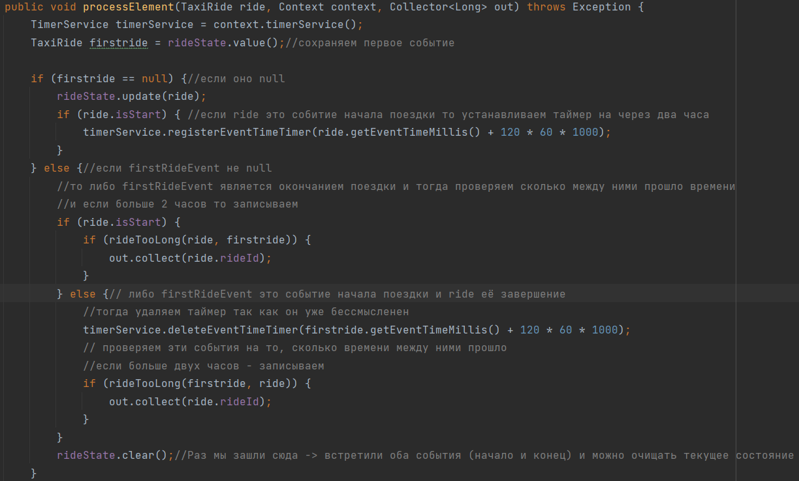

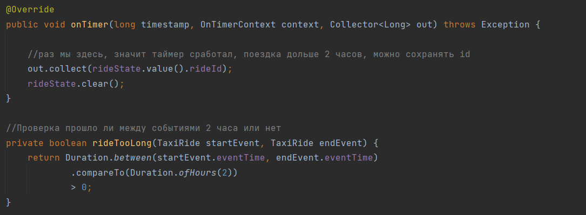

Тест

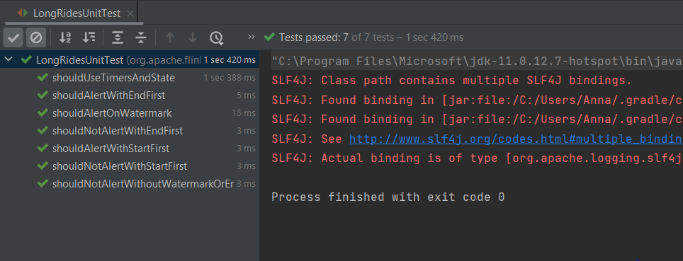

